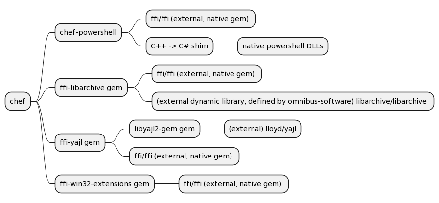

# FFI and Other Native Dependencies



# `chef` org gems
## `chef-powershell` gem

## `ffi-libarchive` gem

## `ffi-yajl` gem

## `ffi-win32-extensions` gem

# External dependencies of the above

## `libarchive` library

## `ffi` gem

## `yajl` library

```text
@startmindmap
* chef
** chef-powershell
*** ffi/ffi (external, native gem) 
*** C++ -> C# shim
**** Windows native powershell DLLs
** ffi-libarchive gem
*** ffi/ffi (external, native gem) 
*** (external dynamic library, defined by omnibus-software) libarchive/libarchive 
** ffi-yajl gem
*** libyajl2-gem gem
**** (external) lloyd/yajl
*** ffi/ffi (external, native gem) 
** ffi-win32-extensions gem
*** ffi/ffi (external, native gem) 
@endmindmap
```