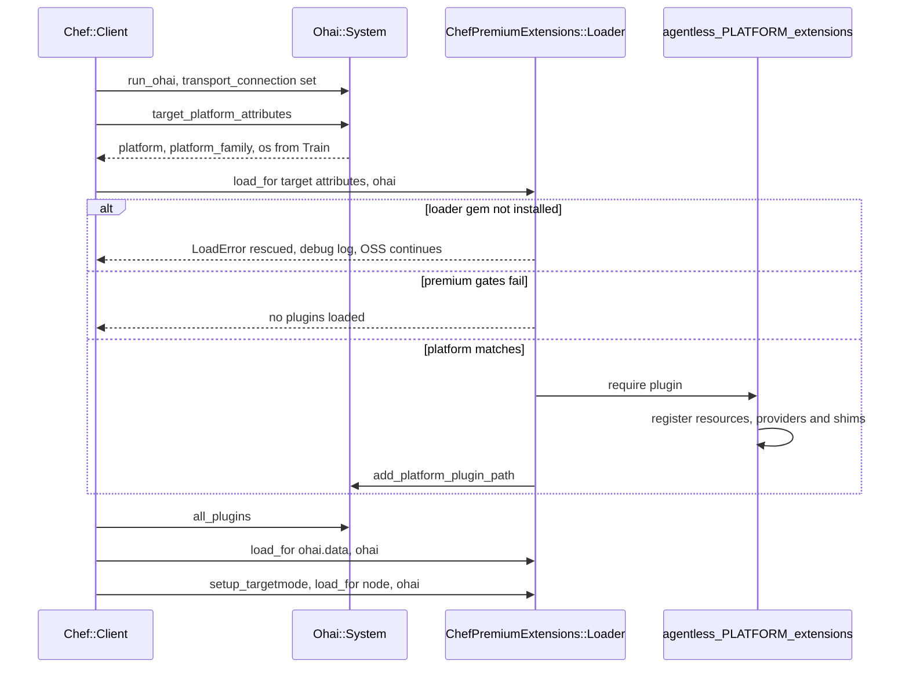

# Target Mode platform extension loading

Chef core no longer defines the AIX-specific resources and providers. In Target
Mode, Chef selects an `agentless_<platform>_extensions` plugin from the target
node's attributes and loads it lazily.

- Only the optional `require "chef_premium_extensions/loader"` is rescued.
  Failures inside a matching extension surface to the user.
- `load_for` is idempotent, so calling it again after Ohai only adds platforms
  that were not already loaded.
- AIX is supplied by `agentless-aix-extensions` (premium Target Mode) or, only
  when explicitly required, the community `chef-aix-resources` snapshot
  (local mode).
