# Pipeline License Requirements Documentation

This document outlines the CI/CD pipelines in the Chef Infra repository and identifies which pipelines and steps require HAB (Habitat) and/or CHEF license keys.

## Overview

The Chef Infra repository uses multiple pipeline systems:
- **Buildkite Pipelines** (via Expeditor) - Primary CI/CD for builds, tests, and releases
- **GitHub Actions** - FIPS validation and specific test workflows

## Legend

- 🔑 **HAB_AUTH_TOKEN** - Habitat authentication token required
- 📜 **CHEF_LICENSE** - Chef license acceptance required (via environment variable or prompt)
- ⚙️ No special licenses required

---

## Buildkite Pipelines

### Verify Pipeline (`verify.pipeline.sh`)

The verify pipeline runs on every pull request and performs comprehensive testing across multiple platforms.

```mermaid
graph TB
    Start([Verify Pipeline Start]) --> UnitTests[Unit/Integration/Functional Tests]

    subgraph Linux["Linux Tests (rocky-8/9, rhel-9, debian-11, ubuntu-2204)"]
        UnitTests --> LinuxUnit["🔑 Unit Tests<br/>(HAB_AUTH_TOKEN)"]
        UnitTests --> LinuxIntegration["🔑 Integration Tests<br/>(HAB_AUTH_TOKEN)"]
        UnitTests --> LinuxFunctional["🔑 Functional Tests<br/>(HAB_AUTH_TOKEN)"]
    end

    subgraph Windows["Windows Tests (windows-2019)"]
        UnitTests --> WinUnit["🔑 Unit Tests<br/>(HAB_AUTH_TOKEN)"]
        UnitTests --> WinIntegration["🔑 Integration Tests<br/>(HAB_AUTH_TOKEN)"]
        UnitTests --> WinFunctional["🔑 Functional Tests<br/>(HAB_AUTH_TOKEN)"]
    end

    subgraph ExternalGems["External Gem Tests"]
        UnitTests --> ChefZero["🔑 chef-zero<br/>(HAB_AUTH_TOKEN)"]
        UnitTests --> Cheffish["🔑 cheffish<br/>(HAB_AUTH_TOKEN)"]
        UnitTests --> ChefSpec["🔑 chefspec<br/>(HAB_AUTH_TOKEN)"]
        UnitTests --> KnifeWindows["🔑 knife-windows<br/>(HAB_AUTH_TOKEN)"]
        UnitTests --> Berkshelf["🔑 berkshelf<br/>(HAB_AUTH_TOKEN)"]
    end

    subgraph HabitatPlans["Habitat Plan Verification"]
        UnitTests --> LinuxPlan["🔑 Linux Plan Build<br/>(HAB_AUTH_TOKEN)"]
        UnitTests --> WindowsPlan["🔑 Windows Plan Build<br/>(HAB_AUTH_TOKEN)"]
    end

    LinuxUnit --> Complete([Pipeline Complete])
    LinuxIntegration --> Complete
    LinuxFunctional --> Complete
    WinUnit --> Complete
    WinIntegration --> Complete
    WinFunctional --> Complete
    ChefZero --> Complete
    Cheffish --> Complete
    ChefSpec --> Complete
    KnifeWindows --> Complete
    Berkshelf --> Complete
    LinuxPlan --> Complete
    WindowsPlan --> Complete

    style LinuxUnit fill:#ff6b6b
    style LinuxIntegration fill:#ff6b6b
    style LinuxFunctional fill:#ff6b6b
    style WinUnit fill:#ff6b6b
    style WinIntegration fill:#ff6b6b
    style WinFunctional fill:#ff6b6b
    style ChefZero fill:#ff6b6b
    style Cheffish fill:#ff6b6b
    style ChefSpec fill:#ff6b6b
    style KnifeWindows fill:#ff6b6b
    style Berkshelf fill:#ff6b6b
    style LinuxPlan fill:#ff6b6b
    style WindowsPlan fill:#ff6b6b
```



**License Requirements:**
- ✅ **HAB_AUTH_TOKEN**: Required for all test steps
  - Propagated via Docker environment in all test containers
  - Used for Habitat package operations
- ❌ **CHEF_LICENSE**: Not explicitly required (set via `CHEF_LICENSE_SERVER` environment variable pointing to hosted license service)

---

### Validate/Adhoc Pipeline (`validate.adhoc.pipeline.sh`)

This pipeline is triggered for adhoc builds and validates Chef Infra Client packages across all supported platforms.

```mermaid
graph TB
    Start([Adhoc Validate Pipeline]) --> BuildPhase[Build Phase]

    subgraph Build["Habitat Package Build"]
        BuildPhase --> LinuxBuild["🔑 Linux Habitat Build<br/>(HAB_AUTH_TOKEN)"]
        BuildPhase --> WindowsBuild["🔑 Windows Habitat Build<br/>(HAB_AUTH_TOKEN)"]
    end

    LinuxBuild --> Wait[Wait for Builds]
    WindowsBuild --> Wait

    Wait --> ValidationPhase[Validation Phase]

    subgraph LinuxValidation["Linux Platform Validation"]
        ValidationPhase --> Amazon2["🔑 Amazon Linux 2<br/>(HAB_AUTH_TOKEN)"]
        ValidationPhase --> CentOS7["🔑 CentOS 7<br/>(HAB_AUTH_TOKEN)"]
        ValidationPhase --> RHEL9["🔑 RHEL 9<br/>(HAB_AUTH_TOKEN)"]
        ValidationPhase --> Debian9["🔑 Debian 9/10/11<br/>(HAB_AUTH_TOKEN)"]
        ValidationPhase --> Ubuntu["🔑 Ubuntu 20.04/22.04<br/>(HAB_AUTH_TOKEN)"]
        ValidationPhase --> Rocky["🔑 Rocky 8/9<br/>(HAB_AUTH_TOKEN)"]
        ValidationPhase --> Amazon2023["🔑 Amazon Linux 2023<br/>(HAB_AUTH_TOKEN)"]
    end

    subgraph ARMValidation["ARM Platform Validation (if ARM_ENABLED=1)"]
        ValidationPhase --> CentOS7ARM["🔑 CentOS 7 ARM<br/>(HAB_AUTH_TOKEN)"]
        ValidationPhase --> Amazon2ARM["🔑 Amazon Linux 2 ARM<br/>(HAB_AUTH_TOKEN)"]
        ValidationPhase --> RHEL9ARM["🔑 RHEL 9 ARM<br/>(HAB_AUTH_TOKEN)"]
        ValidationPhase --> UbuntuARM["🔑 Ubuntu 18.04/20.04/22.04 ARM<br/>(HAB_AUTH_TOKEN)"]
        ValidationPhase --> Amazon2023ARM["🔑 Amazon Linux 2023 ARM<br/>(HAB_AUTH_TOKEN)"]
    end

    subgraph WindowsValidation["Windows Platform Validation"]
        ValidationPhase --> Win2019["🔑 Windows 2019<br/>(HAB_AUTH_TOKEN)"]
        ValidationPhase --> Win2022["🔑 Windows 2022<br/>(HAB_AUTH_TOKEN)"]
        ValidationPhase --> Win2025["🔑 Windows 2025<br/>(HAB_AUTH_TOKEN)"]
    end

    Amazon2 --> Complete([Pipeline Complete])
    CentOS7 --> Complete
    RHEL9 --> Complete
    Debian9 --> Complete
    Ubuntu --> Complete
    Rocky --> Complete
    Amazon2023 --> Complete
    CentOS7ARM --> Complete
    Amazon2ARM --> Complete
    RHEL9ARM --> Complete
    UbuntuARM --> Complete
    Amazon2023ARM --> Complete
    Win2019 --> Complete
    Win2022 --> Complete
    Win2025 --> Complete

    style LinuxBuild fill:#ff6b6b
    style WindowsBuild fill:#ff6b6b
    style Amazon2 fill:#ff6b6b
    style CentOS7 fill:#ff6b6b
    style RHEL9 fill:#ff6b6b
    style Debian9 fill:#ff6b6b
    style Ubuntu fill:#ff6b6b
    style Rocky fill:#ff6b6b
    style Amazon2023 fill:#ff6b6b
    style CentOS7ARM fill:#ff6b6b
    style Amazon2ARM fill:#ff6b6b
    style RHEL9ARM fill:#ff6b6b
    style UbuntuARM fill:#ff6b6b
    style Amazon2023ARM fill:#ff6b6b
    style Win2019 fill:#ff6b6b
    style Win2022 fill:#ff6b6b
    style Win2025 fill:#ff6b6b
```



**License Requirements:**
- ✅ **HAB_AUTH_TOKEN**: Required for all build and validation steps
  - Build phase: Used to build Habitat packages
  - Validation phase: Used to install and test Habitat packages on target platforms
- ❌ **CHEF_LICENSE**: Not explicitly required in pipeline

---

### Validate/Release Pipeline (`verify.release.pipeline.yml`)

Similar to adhoc pipeline but triggered when code is merged to release branches.


**License Requirements:**
- ✅ **HAB_AUTH_TOKEN**: Required (same as adhoc pipeline)
- ❌ **CHEF_LICENSE**: Not explicitly required

---

### Habitat Build Pipeline (`build.habitat.yml`)

Builds Habitat packages for Linux and Windows and publishes to Habitat Builder.

```mermaid
graph TB
    Start([Habitat Build Pipeline]) --> LinuxBuild["🔑 Linux Package Build<br/>(HAB_AUTH_TOKEN)"]
    Start --> WindowsBuild["🔑 Windows Package Build<br/>(HAB_AUTH_TOKEN)"]

    LinuxBuild --> Publish["🔑 Publish to Builder<br/>(HAB_AUTH_TOKEN)"]
    WindowsBuild --> Publish

    Publish --> Promote["🔑 Auto-promote to unstable<br/>(HAB_AUTH_TOKEN)"]

    style LinuxBuild fill:#ff6b6b
    style WindowsBuild fill:#ff6b6b
    style Publish fill:#ff6b6b
    style Promote fill:#ff6b6b
```



**License Requirements:**
- ✅ **HAB_AUTH_TOKEN**: Required for building and publishing
- ❌ **CHEF_LICENSE**: Not explicitly required

---

### Habitat Export Pipeline (`hab-export-pipeline.yml`)

Exports Habitat packages as tarballs and uploads to S3.


**License Requirements:**
- ✅ **PIPELINE_HAB_AUTH_TOKEN**: Required for exporting packages from Builder
  - Injected via Expeditor secrets from `account/static/habitat/chef-ci`
- ❌ **CHEF_LICENSE**: Not required

---

### Habitat Test Pipeline (`habitat-test.pipeline.yml`)

Validates Habitat builds on Linux and Windows after successful package promotion.

```mermaid
graph TB
    Start([Habitat Test Pipeline]) --> LinuxTest["⚙️ Linux Validation<br/>(No HAB_AUTH_TOKEN needed)"]
    Start --> WindowsTest["⚙️ Windows Validation<br/>(No HAB_AUTH_TOKEN needed)"]

    LinuxTest --> Complete([Tests Complete])
    WindowsTest --> Complete

    style LinuxTest fill:#69db7c
    style WindowsTest fill:#69db7c
```



**License Requirements:**
- ❌ **HAB_AUTH_TOKEN**: Not required (uses pre-built package identifiers via `$EXPEDITOR_PKG_IDENTS_*`)
- ❌ **CHEF_LICENSE**: Not explicitly required

---

## GitHub Actions Workflows

### Linux FIPS Validation (`selfhosted-linux-fips.yml`)

Tests Chef Infra Client on Ubuntu with FIPS mode enabled.

```mermaid
graph TB
    Start([Linux FIPS Workflow]) --> Cleanup[Cleanup Previous Installs]
    Cleanup --> Checkout[Checkout Code]
    Checkout --> InstallHab["🔑 Install Habitat CLI<br/>(HAB_AUTH_TOKEN via secrets)"]
    InstallHab --> GenerateKey["🔑 Generate Origin Key<br/>(HAB_AUTH_TOKEN)"]
    GenerateKey --> Build["🔑 Build Habitat Package<br/>(HAB_AUTH_TOKEN)"]
    Build --> SetupToken["🔑 Setup HAB Token File<br/>(HAB_AUTH_TOKEN)"]
    SetupToken --> Install["🔑 Install Package<br/>(HAB_AUTH_TOKEN)"]
    Install --> VerifyFIPS[Verify FIPS Enabled]
    VerifyFIPS --> RunTests[Run Chef Client Tests]

    style InstallHab fill:#ff6b6b
    style GenerateKey fill:#ff6b6b
    style Build fill:#ff6b6b
    style SetupToken fill:#ff6b6b
    style Install fill:#ff6b6b
    style VerifyFIPS fill:#69db7c
    style RunTests fill:#69db7c
```



**License Requirements:**
- ✅ **HAB_AUTH_TOKEN**: Required for all Habitat operations
  - Injected via GitHub Secrets: `${{ secrets.HAB_AUTH_TOKEN }}`
  - Used for: CLI installation, package building, package installation
- ✅ **Chef License**: Implicitly accepted via `hab license accept` command
- Environment variables set:
  - `HAB_ORIGIN: gha`
  - `HAB_BLDR_CHANNEL: base-2025`
  - `HAB_REFRESH_CHANNEL: base-2025`

---

### Windows FIPS Validation (`windows-fips.yml`)

Tests Chef Infra Client on Windows Server with FIPS mode enabled.

```mermaid
graph TB
    Start([Windows FIPS Workflow]) --> Checkout[Checkout Code]
    Checkout --> InstallHab["🔑 Install Habitat CLI<br/>(HAB_AUTH_TOKEN via secrets)"]
    InstallHab --> GenerateKey["🔑 Generate Origin Key<br/>(HAB_AUTH_TOKEN)"]
    GenerateKey --> Build["🔑 Build Habitat Package<br/>(HAB_AUTH_TOKEN)"]
    Build --> Install["🔑 Install Package<br/>(HAB_AUTH_TOKEN)"]
    Install --> EnableFIPS[Enable FIPS via Registry]
    EnableFIPS --> Reboot[Reboot System]
    Reboot --> VerifyFIPS[Verify FIPS Enabled]
    VerifyFIPS --> RunTests[Run Chef Client Tests]

    style InstallHab fill:#ff6b6b
    style GenerateKey fill:#ff6b6b
    style Build fill:#ff6b6b
    style Install fill:#ff6b6b
    style EnableFIPS fill:#69db7c
    style Reboot fill:#69db7c
    style VerifyFIPS fill:#69db7c
    style RunTests fill:#69db7c
```



**License Requirements:**
- ✅ **HAB_AUTH_TOKEN**: Required for all Habitat operations
  - Injected via GitHub Secrets: `${{ secrets.HAB_AUTH_TOKEN }}`
  - Used for: CLI installation, package building, package installation
- ✅ **Chef License**: Implicitly accepted via `hab license accept` command
- Runs on matrix: `[windows-2022, windows-2025]`
- Environment variables set:
  - `HAB_ORIGIN: gha`
  - `HAB_BLDR_CHANNEL: base-2025`
  - `HAB_REFRESH_CHANNEL: base-2025`

---

### Other GitHub Actions Workflows

The following workflows do NOT require HAB or CHEF license keys:

- ✅ **allchecks.yml** - Meta workflow that checks other workflows
- ✅ **sonarqube.yml** - Code quality scanning
- ✅ **lint.yml** - Linting and style checks
- ✅ **unit_specs.yml** - Ruby unit tests without Habitat
- ✅ **func_spec.yml** - Functional tests without Habitat
- ✅ **kitchen.yml** - Test Kitchen integration tests
- ✅ **danger.yml** - PR review automation
- ✅ **labeler.yml** - Auto-labeling PRs

---

## Summary of License Requirements

### HAB_AUTH_TOKEN Requirements

| Pipeline/Workflow | HAB_AUTH_TOKEN Required | Injection Method |
|-------------------|-------------------------|------------------|
| **Buildkite: Verify Pipeline** | ✅ Yes (all steps) | Docker environment propagation |
| **Buildkite: Validate/Adhoc** | ✅ Yes (build + validation) | Docker environment propagation |
| **Buildkite: Validate/Release** | ✅ Yes (build + validation) | Docker environment propagation |
| **Buildkite: Habitat Build** | ✅ Yes (build + publish) | Expeditor defaults |
| **Buildkite: Hab Export** | ✅ Yes (export only) | Expeditor secrets (`PIPELINE_HAB_AUTH_TOKEN`) |
| **Buildkite: Habitat Test** | ❌ No | N/A |
| **GitHub: Linux FIPS** | ✅ Yes (all Habitat steps) | GitHub Secrets |
| **GitHub: Windows FIPS** | ✅ Yes (all Habitat steps) | GitHub Secrets |
| **GitHub: Other workflows** | ❌ No | N/A |

### CHEF_LICENSE Requirements

| Pipeline/Workflow | CHEF_LICENSE Required | Acceptance Method |
|-------------------|----------------------|-------------------|
| **All Buildkite Pipelines** | ❌ Not enforced | Uses `CHEF_LICENSE_SERVER` environment variable |
| **GitHub: Linux FIPS** | ✅ Yes (implicit) | `hab license accept` command |
| **GitHub: Windows FIPS** | ✅ Yes (implicit) | `hab license accept` command |
| **GitHub: Other workflows** | ❌ No | N/A |

---

## Key Findings

### HAB_AUTH_TOKEN Usage Patterns

1. **Buildkite Verify Pipeline**: HAB_AUTH_TOKEN is propagated to all Docker containers for test execution
2. **Buildkite Adhoc/Release**: HAB_AUTH_TOKEN is required for both building and validating packages
3. **Buildkite Habitat Build**: HAB_AUTH_TOKEN is used for publishing packages to Habitat Builder
4. **Buildkite Hab Export**: Uses separate `PIPELINE_HAB_AUTH_TOKEN` from Expeditor secrets vault
5. **GitHub Actions FIPS**: HAB_AUTH_TOKEN injected via GitHub Secrets for package operations

### CHEF License Handling

1. **Buildkite Pipelines**: Use a hosted license server (`CHEF_LICENSE_SERVER`) instead of requiring explicit acceptance
2. **GitHub FIPS Workflows**: Explicitly accept license via `hab license accept` during Habitat CLI installation
3. **No runtime license prompts**: All pipelines either auto-accept or use the license server

### Security Considerations

- HAB_AUTH_TOKEN is stored in:
  - Expeditor vault: `account/static/habitat/chef-ci`
  - GitHub Secrets: `HAB_AUTH_TOKEN`
- Tokens are propagated via environment variables, not exposed in logs
- FIPS workflows generate temporary origin keys for signing (not production keys)

---

## ⚠️ Forked Repository Limitations

### Problem: GitHub Secrets Not Available in Forks

**GitHub Actions workflows that require secrets will FAIL for external contributors** due to GitHub's security model:

```mermaid
graph LR
    subgraph MainRepo["chef/chef (Main Repository)"]
        MainSecrets["✅ GitHub Secrets Available<br/>- HAB_AUTH_TOKEN<br/>- AWS credentials<br/>- etc."]
    end

    subgraph Fork["contributor/chef (Forked Repository)"]
        NoSecrets["❌ GitHub Secrets NOT Available<br/>⚠️ Workflows will FAIL"]
    end

    MainRepo -->|Fork| Fork
    MainSecrets -.->|NOT copied| NoSecrets

    style MainSecrets fill:#69db7c
    style NoSecrets fill:#ff6b6b
```



### Affected Workflows in Forked Repos

| Workflow | Impact on Forks | Failure Point |
|----------|----------------|---------------|
| **selfhosted-linux-fips.yml** | 🔴 **WILL FAIL** | Cannot install Habitat CLI or build packages without `HAB_AUTH_TOKEN` |
| **windows-fips.yml** | 🔴 **WILL FAIL** | Cannot install Habitat CLI or build packages without `HAB_AUTH_TOKEN` |
| **allchecks.yml** | 🟢 **Will work** | No secrets required |
| **unit_specs.yml** | 🟢 **Will work** | No secrets required |
| **func_spec.yml** | 🟢 **Will work** | No secrets required |
| **kitchen.yml** | 🟢 **Will work** | No secrets required |
| **lint.yml** | 🟢 **Will work** | No secrets required |
| **sonarqube.yml** | 🟡 **May fail** | May require SonarQube token |
| **danger.yml** | 🟡 **May fail** | May require GitHub token for PR comments |

### Workflow Behavior Analysis

#### Linux FIPS Workflow (selfhosted-linux-fips.yml)

```yaml
# Line 26: Secret injection - WILL BE EMPTY in forks
env:
  HAB_AUTH_TOKEN: ${{ secrets.HAB_AUTH_TOKEN }}  # ❌ Not available in forks

# Line 42-44: This step WILL FAIL without authentication
- name: Install Habitat CLI
  run: |
    curl https://raw.githubusercontent.com/habitat-sh/habitat/main/components/hab/install.sh | sudo bash -s -- -c stable
    # Without HAB_AUTH_TOKEN, authenticated operations will fail

# Line 17-18: Conditional prevents running on forks by default
if: github.event.pull_request.head.repo.full_name == github.repository || github.event_name == 'push'
```

**Current Mitigation**: The workflow includes a conditional check that **prevents execution on forked PRs**:
```yaml
if: github.event.pull_request.head.repo.full_name == github.repository || github.event_name == 'push'
```

This means:
- ✅ FIPS workflows only run when PR is from a branch in the main repo
- ✅ FIPS workflows only run on pushes to the main repo
- ❌ FIPS workflows are **skipped entirely** for external contributor PRs

#### Windows FIPS Workflow (windows-fips.yml)

Same behavior as Linux FIPS:
```yaml
# Line 29: Secret injection - WILL BE EMPTY in forks
env:
  HAB_AUTH_TOKEN: ${{ secrets.HAB_AUTH_TOKEN }}  # ❌ Not available in forks

# Line 17-18: Conditional prevents running on forks
if: github.event.pull_request.head.repo.full_name == github.repository || github.event_name == 'push'
```

### Impact Summary

#### For External Contributors (Forked Repos)

**What Works:**
- ✅ Basic unit tests (unit_specs.yml)
- ✅ Functional tests (func_spec.yml)
- ✅ Linting and style checks (lint.yml)
- ✅ Kitchen tests (kitchen.yml)
- ✅ All checks workflow (allchecks.yml)

**What Doesn't Work:**
- ❌ **FIPS validation** - Completely skipped for forked PRs
- ❌ **Habitat package builds** - Cannot test Habitat packaging changes
- ❌ **Integration with Habitat Builder** - No authentication available

**The Good News:**
- The conditional checks prevent workflows from **failing** - they simply **skip** instead
- Core test coverage (unit, functional, integration) is available to contributors
- Maintainers can trigger FIPS/Habitat workflows after merging to a branch in the main repo

**The Bad News:**
- Contributors cannot validate FIPS compliance locally via GitHub Actions
- Contributors cannot test Habitat packaging changes in their PRs
- Maintainers must trust non-FIPS tests and potentially run additional validation

### Workarounds and Recommendations

#### For Contributors

1. **Run Habitat builds locally** (if you have your own Habitat setup):
   ```bash
   # Generate a local origin key
   hab origin key generate myorigin

   # Build locally
   hab pkg build .
   ```

2. **Focus on non-Habitat tests** in your PR:
   - Ensure unit tests pass
   - Ensure functional tests pass
   - Ensure linting passes
   - Let maintainers validate FIPS/Habitat after initial review

3. **Request maintainer validation**:
   - Ask a maintainer to push your branch to a branch in the main repo
   - This allows FIPS workflows to run with proper secrets

#### For Maintainers

1. **Review strategy for external PRs**:
   ```
   External PR → Review code → Push to branch in main repo → FIPS tests run
   ```

2. **Alternative: Pull request to branch workflow**:
   ```bash
   # Create a branch in the main repo from contributor's PR
   git checkout -b contributor-feature
   git pull https://github.com/contributor/chef.git feature-branch
   git push origin contributor-feature
   # Now FIPS workflows will run with secrets
   ```

3. **Consider adding a comment bot** that explains to contributors:
   - Why FIPS tests are skipped on their fork
   - What tests they should focus on
   - That FIPS validation will happen after maintainer review

#### Potential Long-term Solutions

1. **Self-hosted runners with fork support** (requires careful security review):
   - Set up runners that can safely execute forked PR code
   - Implement approval workflow before running sensitive tests
   - **RISK**: Forks could potentially exfiltrate secrets if not properly isolated

2. **Separate FIPS validation from PR checks**:
   - Run FIPS validation only on merge to main
   - Make FIPS checks optional for PR approval
   - **TRADE-OFF**: Reduces pre-merge confidence in FIPS compliance

3. **Public Habitat Builder alternative**:
   - Use a publicly accessible Habitat Builder instance
   - Generate ephemeral tokens per PR
   - **LIMITATION**: Still requires infrastructure and maintenance

4. **GitHub Environment Secrets with manual approval**:
   - Use GitHub Environments to require manual approval before exposing secrets
   - Maintainers approve each run on forked PRs
   - **PRO**: Secure and allows fork testing
   - **CON**: Adds manual overhead for maintainers

### Current Status: ✅ Secure But Limited

The current implementation prioritizes **security over convenience**:
- ✅ Secrets are never exposed to forked repositories
- ✅ FIPS workflows gracefully skip on forks (don't fail)
- ✅ Core test coverage remains available to all contributors
- ⚠️ FIPS validation happens post-review for external contributions
- ⚠️ Habitat packaging changes cannot be validated by external contributors

This is a **reasonable trade-off** for an open-source project handling infrastructure automation tools.

---

## References

- **Verify Pipeline**: `.buildkite/verify.pipeline.sh`
- **Adhoc Validation**: `.buildkite/validate.adhoc.pipeline.sh`
- **Adhoc Validator Script**: `.buildkite/validate-adhoc.rb`
- **Expeditor Config**: `.expeditor/config.yml`
- **Hab Export Pipeline**: `.expeditor/hab-export-pipeline.yml`
- **Habitat Test Pipeline**: `.expeditor/habitat-test.pipeline.yml`
- **Linux FIPS Workflow**: `.github/workflows/selfhosted-linux-fips.yml`
- **Windows FIPS Workflow**: `.github/workflows/windows-fips.yml`
